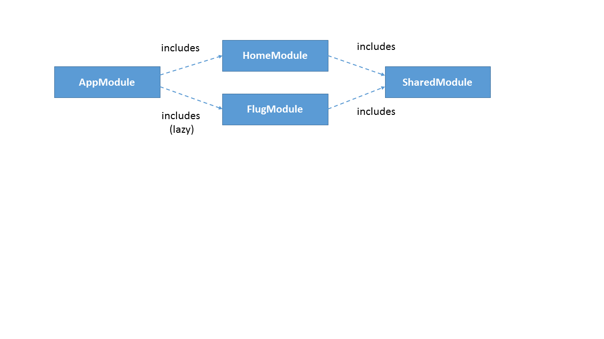

# Lazy Loading mit Angular 2, Module und webpack2

## Überblick

## Benötigte Software

- NodeJS (nodejs.org)

## Installation und Ausführung

- Installation der Pakete: ``npm install``
- Start: ``npm start``